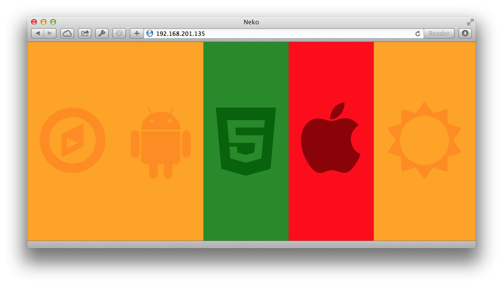

Neko
====

Simple web-based status board for Hudson and Jenkins.

Screenshots
-----------

Installation
------------

### Apache

The specifics of your configuration will depend on the location of your install but should look something like this:  

    <VirtualHost *:80>

      DocumentRoot /usr/share/neko/site/

      <Directory /usr/share/neko/site/>
        AllowOverride All
      </Directory>

      WSGIScriptAlias /api /usr/share/neko/api.wsgi

      LogLevel warn

    </VirtualHost>

Configuration
-------------

The Hudson and Jenkins projects to check are specified config.json located in the root, alongside api.wsgi.  Individual projects are defined as a list of Hudson or Jenkins build jobs.  Each job can be tagged with as a build or test job and optional authentication details can be provided.

    {
      "version": 1,
      "projects": {
        "Project One": {
          "jobs": [
            {
              "url": "https://jenkins/view/All/job/iOS-Build/api/json", "type": "build",
              "username": "user", "password": "password"
            },
            {
              "url": "https://jenkins/view/All/job/iOS-Unit-Test/api/json", "type": "test",
              "username": "user", "password": "password"
            },
            {
              "url": "https://jenkins/view/All/job/iOS-Functional-Test/api/json", "type": "test",
              "username": "user", "password": "password"
            },

            ...

          ],
          "icon": "icon-apple"
        },
        "Android": {
          "jobs": [
            {
              "url": "http://hudson/view/All/job/Android-Build/api/json", "type": "build"
            },

            ...

          ],
          "icon": "icon-android"
        },

        ...

      }
    }

Things to bear in mind:
- Hudson and Jenkins job URLs should include the 'api/json' extension
- Icons are provided by [Font Awesome](http://fontawesome.io) and should be specified using appropriate class names (see the [cheatsheet](http://fontawesome.io/cheatsheet/))